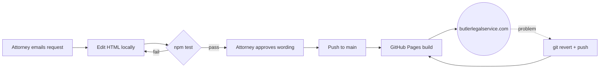

<p align="center">
  
</p>

<h1 align="center">Butler Legal Service</h1>

<p align="center">
  Legal consulting and advocacy · Missouri and North Carolina<br>
  <sub>Static site for Butler Legal Service, P.L.L.C., led by Shatrasha Butler</sub>
</p>

<p align="center">
  <a href="https://butlerlegalservice.com"></a>
  <a href="https://github.com/NateButlerExplains/ButlerLegalService-Webpage/actions/workflows/pages/pages-build-deployment"></a>
  
  
  
</p>

<p align="center">
  <a href="https://butlerlegalservice.com"><b>Live site</b></a> ·
  <a href="#making-changes">Making changes</a> ·
  <a href="#run-and-test-locally">Run and test</a> ·
  <a href="#before-you-push">Pre-publish checklist</a>
</p>

---

> [!WARNING]
> **Push equals publish.** Anything merged to `main` is live at butlerlegalservice.com within about a minute. There is no staging site. Preview locally and run the tests first.

## At a glance

| | |
|---|---|
| **Live** | https://butlerlegalservice.com |
| **Hosting** | GitHub Pages, from `main` root. HTTPS enforced. `http://` and `www.` redirect to the apex. |
| **DNS** | GoDaddy (`CNAME` file in repo points Pages at the domain) |
| **Stack** | Hand-written HTML, CSS, and a small vanilla JS file. No framework, no build step. |
| **Tests** | Playwright, Chromium. Link integrity, branding, service heroes, mobile nav. |
| **Practice** | Virtual, by appointment. No street address is published. |
| **Content owner** | Butler Legal Service, P.L.L.C. **Shatrasha Butler is the sole approver of wording.** No one else can sign off on copy. |
| **Maintainer** | [Nate Butler](https://github.com/NateButlerExplains). Attorney emails change requests with page name and exact wording. |
| **Reporting back** | Email her a short summary after any content or wording change. Routine maintenance (dependencies, tests, build) needs no email. |

## Screens

<table>
  <tr>
    <td align="center" width="70%"><br><sub>Desktop</sub></td>
    <td align="center" width="30%"><br><sub>Mobile</sub></td>
  </tr>
</table>

## How a change reaches the site



## Making changes

| Page | File | Approval |
|---|---|---|
| Home | `index.html` | Attorney reviews wording |
| Accident Claims & Injury Guidance | `accident-claims.html` | Attorney |
| Estate & Legacy Planning | `estate-planning.html` | Attorney |
| Small Business Legal Support | `business-legal-support.html` | Attorney |
| Contract Review & Negotiation | `contract-review.html` | Attorney |
| Privacy Policy | `privacy.html` | **Attorney, always** |
| Terms of Use | `terms.html` | **Attorney, always** |
| Disclaimer | `disclaimer.html` | **Attorney, always** |

Shared: `styles.css` (all styling) · `script.js` (mobile nav, header scroll state, scroll reveal) · `assets/` (images, brand mark).

> [!IMPORTANT]
> **Legal text is verbatim.** The Privacy Policy, Terms of Use, and Disclaimer are transcribed from attorney-approved documents. The attorney holds the originals. Never rewrite, shorten, paraphrase, or "improve" them. Change them only when she supplies new approved text, and paste it exactly.

> [!NOTE]
> **Jurisdiction.** Every page keeps the statement that the attorney is licensed only in Missouri and North Carolina. Do not add language implying services elsewhere.

**Brand.** Green `#18382f`, gold `#c6a35d`, paper `#fbfaf6`, ink `#111816` (all defined as CSS variables at the top of `styles.css`). Georgia for headings, Inter for body. Build new sections from the components already in `styles.css`; do not introduce new colors or fonts.

## Run and test locally

<details>
<summary><b>Preview the site</b></summary>

```bash
python3 -m http.server 8000
```

Open http://localhost:8000. The site itself has no dependencies.
</details>

<details>
<summary><b>Run the Playwright suite</b></summary>

```bash
npm install
npx playwright install --with-deps chromium
npm test
```

`npm test` starts its own server on port 4173 (needs Python 3 on PATH). If the port is busy: `PLAYWRIGHT_PORT=5000 npm test`. Use `npm run test:ui` for the interactive runner.

`npm run shots` refreshes the README screenshots from the live site into `.github/readme/`.
</details>

<details>
<summary><b>Roll back a bad deploy</b></summary>

```bash
git revert <sha>
git push
```

Pages rebuilds automatically. Watch the run under **Actions → pages build and deployment**.
</details>

## Before you push

- [ ] `npm test` passes
- [ ] Any copy change has attorney sign-off; legal pages use her exact text
- [ ] Checked at phone width
- [ ] Commit message says what changed and why, in words the attorney could read
- [ ] If wording changed, email the attorney a short summary of what is now live

---

<p align="center">
  <sub>© Butler Legal Service, P.L.L.C. All rights reserved. Content, images, and brand assets are the property of Butler Legal Service and may not be reused. This repository is public for hosting convenience only; that is not a license.</sub><br>
  <sub>Maintained by <a href="https://github.com/NateButlerExplains">Nate Butler</a></sub>
</p>
